Here's my current workflow to create technical architecture diagrams from code.

**STEP 1: Copy the code**

Here's a one-liner using [files-to-prompt](https://github.com/simonw/files-to-prompt) to copy all files in the current directory:

```bash
fd | xargs uvx files-to-prompt --cxml | xclip -selection clipboard
```

Or, you can specify individual files:

```bash
uvx files-to-prompt --cxml README.md ... | xclip -selection clipboard
```

**STEP 2: Prompt for the a Mermaid diagram**

[Mermaid](https://www.mermaidchart.com/) is a Markdown charting language. I use this prompt with [O4-Mini-High](https://chatgpt.com/?model=o4-mini-high) or [O3](https://chatgpt.com/?model=o3):

> Create a Mermaid architecture diagram for the files below.
>
> Make sure that the diagram is rich in visual detail and looks impressive.
> Use the "neutral" theme.
> Name nodes and links semantically and label them clearly. Avoid parantheses.
> Quote subgraph labels.
> Use apt `shape: rect|rounded|stadium|...` for nodes.
> Add suitable emoticons to every node.
> Style nodes and links with classes most apt for them.
>
> Follow that with a bulleted explanation of the architectural elements that is suitable for adding to a slide.
>
> Finally, double-check the architecture against the codebase and provide a step-by-step validation report.
>
> [PASTE CODE]

**STEP 3: Copy the diagram into Mermaid Live Editor**

Here's a sample output that you can paste into a new [Mermaid Playground](https://www.mermaidchart.com/play#pako:eNqVV01v4zYQ_SsDLQxf4i3adA8VugsE2S0QwG2DdRd7qHtgyJHFmCZVknLiBvnvHYr6dqLYOTgSOR-Pb2Ye7aeEG4FJmsxmT1JLnz7NfY47nKdzjaW3TM2fn2eztc6UeeA5sx6WX9caYDaDpeFMgcA9KlPsUHtAvZfW6PAcbFx5t7GsyGGdRNvPne06CRYQ3P9eJ79KbrTMDovwH8LHx_lOyNSj3UlNIOBBCp9_nP_08xxylJvcV88_fII2MvxVG6-Tf0Js1GKta6i31twj90CBM7mBTCp0I4TX1VZpmZdGuwbeg2V6o9DG3VeQOrkrFFYrLuXKlCJTzOIE6O91WIhxa8QABeNbtsHJbIGX2m6xZ1Yy7Scy3UbLYaI-NdctXvhu7JYw2VJ7uUNgWgBzDv0RVUcuX6NLy1q1Wi--cgxlNuZEtiby1byFJp6gSxHbZeDrnu2Z41YWU5RdFYWSvOoDok10WVyBfCJL6KrFvTN6IvafBeqr2xtYUagu7gPbbNB-u5mkqraaCL6KFvDtpg2NjzTD3H_RojBS-wn0rJATob_EOIGSJtYLvURWaGkCYbn8HRzaveSxjRxye9xHrfkqmrZTp9TuqpCnTJshPtkU8IDkN1NqYQ9wnTMPxH7Hjt6vKmRPE71j-HaKmE7yIMZaJ89HvBAFJfHhKjK8Mep4pGRPFHn19sd0U_PSTuli6LIm6lGhekIMsawVIBJjWCwIDgpJ1Uro5VM1W2maRrOl1NuBJa9lExvzoWKe4TjQvtf9SJ1ceGvS9aVm5NUetlDmEM9K9N-VUomwNUQao4vK1sFeMrhe3pyQZCTaMYzUzjOlKqCUnqhHzWV7VFqlKIJ5NgBaJ4A7zNleGlvVZJC7rs4j8tLjZIHCYrTO6dB03YE1pZeaLj9ja8eROEzECLPc5gsyeLJtI20vlyZMJ2VG22vCEaqG0L3ZtlGjPhxhaMcZFu_Jh5U-N1b-V7m977sdMR8H5QhKN4fN0bQgIvHfEp2nOT6Vx1GYDD3P36Bz5LKXrpvIN0hd-YMKhRaYha903WHoMv-MWfMlqPqjO0ul77JfsgvnLTGcvru8vKyfF5W2pD8WjyN3AgV9d5GJ090D9yN3cUb2UgIM3bNzstMtN3YXeLo7NjdW6454Bvh4DQ6znwE-NkXfnWdvZR-evm0WunzOKVh0aZwWgjn6KWDZIf1w8aHtuyvn5EaDDv1ReWPXdyOxvRhqZuzIzrhqsfDRLYUpqaD0lpoxoKboVsfyQRXvoRiIaVPNbj8qxAsbnbTEGnY7pOUXvWmNj2udPP8PJRGGhw):

```mermaid
%%{init: {'theme':'neutral'}}%%
flowchart TB
  %% Source files
  subgraph "Source Files 📁"
    direction LR
    RT_wr[wrangler.toml 🔧]:::config
    PK_pkg[package.json 📦]:::config
    JS_idx[src/index.js 🖥️]:::code
    JSON_spec[openapi.json 📄]:::assets
    HTML_swagger[swagger.html 📜]:::assets
  end

  %% Build & deploy steps
  subgraph "Build & Deploy 🛠️"
    direction LR
    DEV["npm run dev / wrangler dev ▶️"]:::action
    SECRET["npx wrangler secret put LLMFOUNDRY_TOKEN 🔑"]:::action
    DEPLOY["npm run deploy / wrangler deploy 🚀"]:::action
  end

  %% Runtime environment
  subgraph "Runtime Environment ☁️"
    direction TB
    CF_WORKER["Cloudflare Worker ✨"]:::worker

    subgraph "Request Processing 🔄"
      direction LR
      API_ROUTER["API Router 🔀"]:::logic

      subgraph "Endpoints 🌐"
        EXTRACT["/extract 🚀"]:::endpoint
        OPENAPI["/openapi.json 📄"]:::endpoint
        DOCS["/docs (or /) 📘"]:::endpoint
      end

      subgraph "Handlers 🛠️"
        HANDLE["handleExtract 📝"]:::logic
        SERVE_SPEC["serveOpenApi (spec) 📑"]:::logic
        SERVE_SWAGGER["serveSwaggerUI 🖥️"]:::logic
        NOT_FOUND["404 NotFound ❓"]:::logic
      end
    end

    subgraph "Extraction Flow 🤖"
      PROMPT["createExtractionPrompt 🤔"]:::logic
      GPT_API["LLM Foundry API 🔗"]:::external
    end
  end

  %% Connections
  RT_wr --> CF_WORKER
  PK_pkg --> DEV
  JS_idx --> CF_WORKER
  JSON_spec --> CF_WORKER
  HTML_swagger --> CF_WORKER

  DEV --> CF_WORKER
  SECRET --> CF_WORKER
  DEPLOY --> CF_WORKER

  CF_WORKER --> API_ROUTER
  API_ROUTER --> EXTRACT
  API_ROUTER --> OPENAPI
  API_ROUTER --> DOCS

  EXTRACT --> HANDLE
  OPENAPI --> SERVE_SPEC
  DOCS --> SERVE_SWAGGER

  HANDLE --> PROMPT
  PROMPT --> GPT_API

  API_ROUTER --> NOT_FOUND

  %% Styling classes
  classDef config     fill:#f0f0f0,stroke:#333,stroke-width:1px;
  classDef code       fill:#e0f7fa,stroke:#333,stroke-width:1px;
  classDef assets     fill:#fce4ec,stroke:#333,stroke-width:1px;
  classDef action     fill:#fff9c4,stroke:#333,stroke-width:1px;
  classDef worker     fill:#e8f5e9,stroke:#333,stroke-width:1px;
  classDef logic      fill:#e3f2fd,stroke:#333,stroke-width:1px;
  classDef endpoint   fill:#ffebee,stroke:#333,stroke-width:1px;
  classDef external   fill:#ede7f6,stroke:#333,stroke-width:1px;
```




**STEP 4: Export the diagram**

- If you log in, you can export as PNG.
- If not, you can export it as SVG or take a screenshot.

Note: Technically, this is a flowchart, not an architecture diagram. Mermaid does support [architecture diagrams](https://mermaid.js.org/syntax/architecture.html), but they are in beta and don't look good.

---

## Comments

<!-- wp-comments-start -->

- **[How to create a Technical Architecture from code with ChatGPT and PlantUML - S Anand](/blog/how-to-create-a-technical-architecture-from-code-with-chatgpt-and-plantuml/)** _24 May 2025 9:18 am_ _(pingback)_:
  […] Earlier, I used Mermaid for technical architectures. But PlantUML seems a better option for cloud architecture diagrams. […]

<!-- wp-comments-end -->
